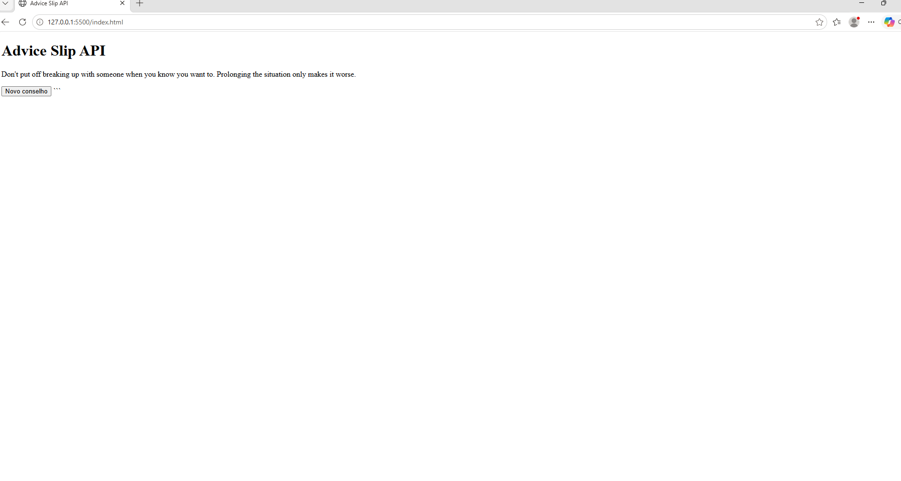

Advice Slip API

1. Qual API você usou

Advice Slip JSON API (https://api.adviceslip.com).

2. O que ela devolve

Devolve um objeto JSON contendo um ID e uma frase com um conselho aleatório em inglês.

3. O endereço que você chamou

'https://api.adviceslip.com/advice'

4. Como rodar

Basta abrir o arquivo `index.html` diretamente em qualquer navegador de sua preferência, sem a necessidade de um servidor web ou instalação de dependências.

5. Um print da tela funcionando

6. Uma dificuldade que você teve

Uma dificuldade foi acessar corretamente o conselho dentro do JSON. Resolvi usando `dados.slip.advice` para mostrar o texto na página.
